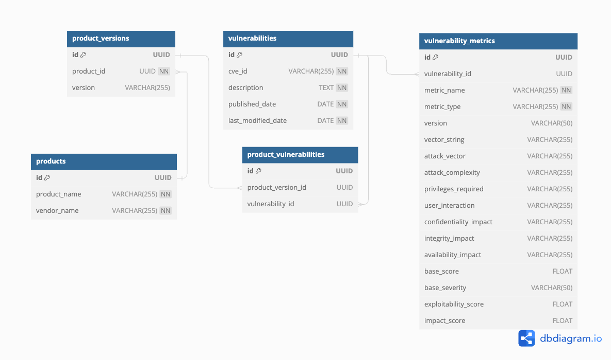

# CVE Analysis

## Overview

Provide a brief overview of the project. Describe what the project is about and its main features.

## Data Model



## Prerequisites
Before you begin, ensure you have the following tools installed:
- **SDKMAN!**: For MacOS and Linux users to manage dev tools
- **Gradle 8.9** : Java build tool, better to be installed with **SDKMAN!**
- **Java 21**: Temurin JDK, better to be installed with **SDKMAN!**
- **Docker or Podman**
- **Python 3**
- **pip**
- **NIST API Key**: NIST API requires api key, please create personal api key to ingest the data: https://nvd.nist.gov/developers/request-an-api-key

## Installation
### Database
Two options, depending on a local setup **Docker** or **Podman**.
The compose command will run the database defined in `docker-compose.yaml`

**Running PostgreSQL with Docker**

To run the database using Docker, execute:
```bash
docker-compose up
```

To run without logs

```bash
docker-compose up -d
```

**Or running PostgreSQL with Podman**

To run the database using Podman, execute:
```bash
podman-compose up
```

To run without logs
```bash
podman-compose up -d
```

### Database Migrator
Before running the data ingestion pipeline and REST API, create all database tables.

**Build Spring Boot project with Gradle**
```bash
./gradlew build
```

**Run migration**
```bash
./gradlew :db-migrator:run
```

### Data Ingestion Pipeline
The pipeline uses Python 3 and venv. It is located in data-ingest directory.

```bash
cd data_ingest
```

**Activate the Virtual Environment**

- On **Windows**:

    ```bash
    venv\Scripts\activate
    ```

- On **Unix or MacOS**:

    ```bash
    source venv/bin/activate
    ```

**Install Dependencies with PIP**

Dependencies listed in the `requirements.txt` file.

```bash
pip install -r requirements.txt
```

**Set API Key**

Open **cve_ingestion_pipeline.py** and set your api key at line 21.
```
api_key = 'your_key'
```

**Run the Python Script**

With the virtual environment activated and dependencies installed, 
you can now run the ingest pipeline. 
Logs from the pipeline should show process life cycle.

```bash
python3 cve_ingestion_pipeline.py
```

Once the pipeline is finished, the REST API is ready to be running.


### REST API
Run the following command from the project root directory

```bash
./gradlew :app:run
```

Once the project is running the API must be available from Swagger at http://localhost:8080/api/v1/swagger-ui/index.html